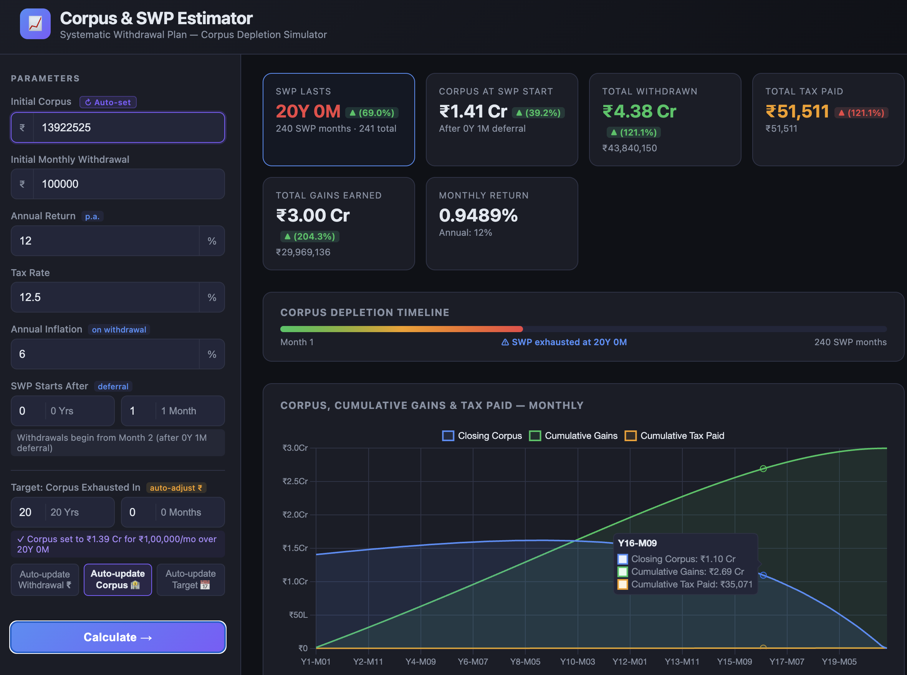
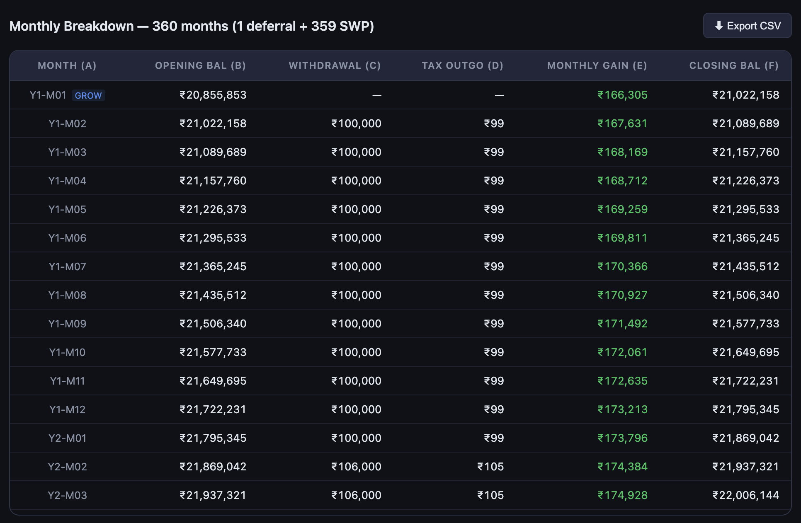

# SWP Estimator

A single-file, zero-dependency web app to simulate **Systematic Withdrawal Plans (SWP)** from a mutual fund corpus. Enter your parameters and instantly see how long your corpus lasts, month-by-month breakdowns, and interactive charts — all running locally in your browser.

## Screenshots

### Summary Dashboard


### Monthly Table


## Features

- **Corpus depletion simulation** — calculates exactly how many years and months until the corpus is exhausted
- **LTCG tax modelling** — tax is applied on the gain fraction of each withdrawal, not the full amount
- **Inflation-adjusted withdrawals** — monthly withdrawal amount increases every 12 months by the specified annual inflation rate
- **SWP deferral** — set a growth-only phase (years + months) before withdrawals begin; corpus compounds untouched during this period
- **Three-mode auto-solver** — pick which field to auto-calculate:
  - 🟢 **Auto-update Withdrawal** — given corpus + target duration, solves the maximum sustainable monthly withdrawal
  - 🟣 **Auto-update Corpus** — given withdrawal + target duration, solves the minimum required initial corpus
  - 🟡 **Auto-update Target** — given corpus + withdrawal, computes the actual exhaustion time and fills the target fields
- **Persistent field highlights** — the auto-updated field shows a coloured border and "↻ Auto-set" badge until manually edited
- **Field locking** — the field managed by the active solver is locked (read-only) with a tooltip on click
- **Delta indicators on recalculate** — changed summary cards flash and show ▲/▼ % badges comparing previous vs new result
- **Interactive chart** — line chart showing Closing Corpus, Cumulative Gains, and Cumulative Tax Paid over time (Chart.js)
- **Stale results indicator** — button pulses amber and a banner appears when inputs are changed after calculation
- **CSV export** — download the full monthly table as a CSV file

## Inputs

| Field | Description | Default |
|---|---|---|
| Initial Corpus | Starting fund value (locked when Auto-update Corpus is active) | ₹1,00,00,000 |
| Monthly Withdrawal | Amount withdrawn each month (locked when Auto-update Withdrawal is active) | ₹1,00,000 |
| Annual Return | Expected annual return of the fund | 12% |
| Tax Rate | LTCG tax on gains component of each withdrawal | 12.5% |
| Annual Inflation | Rate at which withdrawal increases each year | 6% |
| SWP Starts After | Deferral period before withdrawals begin | 0Y 1M |
| Target: Corpus Exhausted In | Desired duration (locked when Auto-update Target is active) | — |

## Solver Modes

Select a mode using the toggle buttons below the Target field:

| Mode | Locked Field | What is solved |
|---|---|---|
| Auto-update Withdrawal ₹ | Monthly Withdrawal | Largest withdrawal where corpus lasts ≥ target duration |
| Auto-update Corpus 🏦 | Initial Corpus | Smallest corpus where withdrawal lasts ≥ target duration |
| Auto-update Target 📅 | Target duration fields | Actual exhaustion time from the current corpus + withdrawal |

Solvers use binary search (100 iterations) and run automatically on every **Calculate** click.

## Calculation Logic

Each month in the **SWP phase**:

```
Monthly Gain (E)  = Opening Balance (B) × Monthly Return Rate
Total             = B + E
Withdrawal (C)    = min(target withdrawal, Total)
Gain Fraction     = E / Total
Tax Outgo (D)     = C × Gain Fraction × Tax Rate
Closing Bal (F)   = Total − C − D
```

During the **deferral phase**, the corpus grows at the monthly rate with no withdrawal or tax.

Inflation is applied at the start of each new SWP year (every 12 SWP months).

Monthly Return Rate is derived automatically as `(1 + Annual Return)^(1/12) − 1`.

## Usage

Open `index.html` directly in any modern browser — no server or build step needed.

```bash
open index.html
```

## Tech Stack

- Pure HTML / CSS / JavaScript (vanilla, no framework)
- [Chart.js 4.4](https://www.chartjs.org/) (loaded from CDN)
